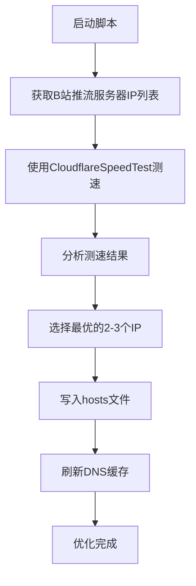

# B站直播推流优化工具


## 📖 项目简介

B站直播推流优化工具是一个专为解决海外地区B站直播推流不稳定问题而设计的自动化脚本。通过智能测速选择最优服务器节点，显著降低直播延迟和丢包率。

### 🎯 解决的问题

- 海外地区B站直播推流延迟高（40ms-160ms波动）
- 推流连接不稳定，经常断流
- DNS随机分配导致连接到较远的服务器节点

### ✨ 功能特点

- 🚀 **自动测速**：智能测试所有可用的B站推流服务器
- 🎯 **最优选择**：自动选择延迟最低、丢包最少的服务器
- 🔧 **一键配置**：自动修改hosts文件，无需手动操作
- 🔄 **循环菜单**：支持多次操作，无需重复启动
- 🧹 **快速清理**：一键清除配置，恢复默认设置
- 👀 **状态查看**：实时查看当前生效的优化配置

## 📋 使用前后对比

| 项目 | 优化前 | 优化后 | 改善 |
|------|--------|--------|------|
| 平均延迟 | 120-160ms | 90-100ms | ⬇️ 30-40% |
| 延迟稳定性 | 波动大 | 稳定 | ✅ 显著改善 |
| 丢包率 | 1-5% | 0-1% | ⬇️ 80%+ |
| 推流稳定性 | 经常断流 | 基本无断流 | ✅ 显著改善 |

## 🛠️ 安装使用

### 前置要求

- Windows 7/8/10/11
- 管理员权限
- 稳定的网络连接

### 下载文件

1. **下载本项目脚本**

   直接下载 `speed.bat` 文件

2. **下载CloudflareSpeedTest工具**
   - 访问 [CloudflareSpeedTest Release页面](https://github.com/XIU2/CloudflareSpeedTest/releases)
   - 下载最新版本的 `CloudflareST.exe`

### 文件结构

确保文件按以下结构放置：
```
项目文件夹/
├── speed.bat          # 本项目的优化脚本
└── CloudflareST.exe   # CloudflareSpeedTest工具
```

### 使用步骤

1. **右键点击 `speed.bat`**
2. **选择"以管理员身份运行"**
3. **根据菜单选择操作**：
   ```
   1 - 测速并设置最优推流服务器
   2 - 清除hosts文件中的B站推流设置  
   3 - 查看当前hosts中的B站配置
   4 - 退出程序
   ```

### 首次使用建议

1. 选择 `3` 查看当前配置状态
2. 选择 `1` 进行测速优化（需要2-5分钟）
3. 选择 `3` 确认配置是否生效
4. 开始B站直播测试效果

## 📊 工作原理

### 技术原理



### 优化过程详解

1. **DNS解析**：获取 `live-push.bilivideo.com` 的所有可用IP地址
2. **网络测速**：对每个IP进行延迟和丢包测试
3. **智能筛选**：选择延迟最低、丢包最少的优质节点
4. **Hosts配置**：将最优IP写入系统hosts文件
5. **DNS刷新**：清除DNS缓存，使配置立即生效

## 🎮 扩展用途

此工具的核心技术可用于优化其他服务：

### 游戏优化
```bash
# 优化原神
live-push.bilivideo.com → osasia-6-lb.yuanshen.com

# 优化英雄联盟  
live-push.bilivideo.com → prod.lo.riotgames.com
```

### 视频平台优化
```bash
# 优化YouTube
live-push.bilivideo.com → googlevideo.com

# 优化Netflix
live-push.bilivideo.com → nflxvideo.net
```

### 开发工具优化
```bash
# 优化GitHub
live-push.bilivideo.com → github.com

# 优化Steam
live-push.bilivideo.com → steamcontent.com
```

## ⚠️ 注意事项

### 系统要求
- ✅ **必须以管理员身份运行**（修改hosts文件需要管理员权限）
- ✅ **确保CloudflareST.exe在同一目录**
- ✅ **杀毒软件可能会报警**（修改hosts文件属于正常行为，请允许操作）

### 使用建议
- 🔄 **定期重新测速**（建议每周运行一次以获得最佳效果）
- 🌐 **网络环境变化后重新优化**（更换网络运营商或地理位置后）
- 🧹 **遇到问题时可以清除配置**（选择选项2恢复默认设置）

### 安全说明
- ✅ 本工具只修改hosts文件，不涉及任何系统核心文件
- ✅ 所有操作都可以通过清除功能完全恢复
- ✅ 开源透明，可自行审查代码安全性

## 🔧 故障排除

### 常见问题

**Q: 显示中文乱码怎么办？**
A: 脚本已添加UTF-8编码支持，如仍有问题请将文件保存为ANSI编码

**Q: 提示找不到CloudflareST.exe？**  
A: 确保CloudflareST.exe与speed.bat在同一文件夹中

**Q: 测速结果为0怎么办？**
A: 检查网络连接，确保可以正常访问国际网络

**Q: 优化后效果不明显？**
A: 可能你的网络本身已经很优秀，或当前时段网络较好

**Q: 如何完全清除配置？**
A: 运行脚本选择选项2，或手动删除hosts文件中相关行

### 手动验证配置

检查hosts文件：
```cmd
notepad C:\Windows\System32\drivers\etc\hosts
```

验证DNS解析：
```cmd
nslookup live-push.bilivideo.com
```

## 📄 开源协议

本项目采用 [MIT License](LICENSE) 开源协议

## 🤝 贡献指南

欢迎提交 Issue 和 Pull Request 来帮助改进这个项目！

### 贡献方式
- 🐛 **报告Bug**：发现问题请提交Issue
- 💡 **功能建议**：有新想法欢迎讨论
- 🔧 **代码改进**：提交PR改进代码
- 📚 **文档完善**：帮助完善使用文档

## 🙏 致谢

- [XIU2/CloudflareSpeedTest](https://github.com/XIU2/CloudflareSpeedTest) - 提供了优秀的网络测速工具
- B站直播推流技术社区 - 提供了宝贵的技术支持和反馈

---

⭐ 如果这个工具对你有帮助，请考虑给项目点个星星！

📺 **愉快直播，告别卡顿！**
